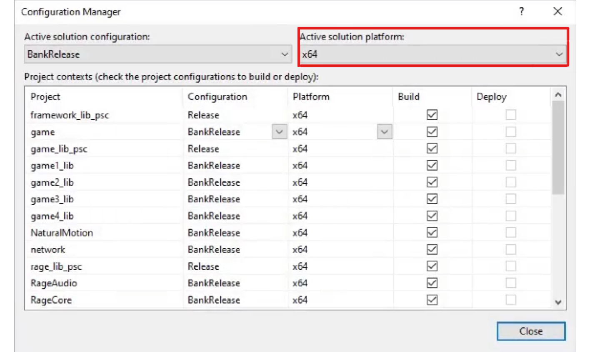
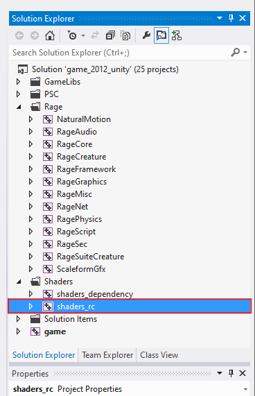
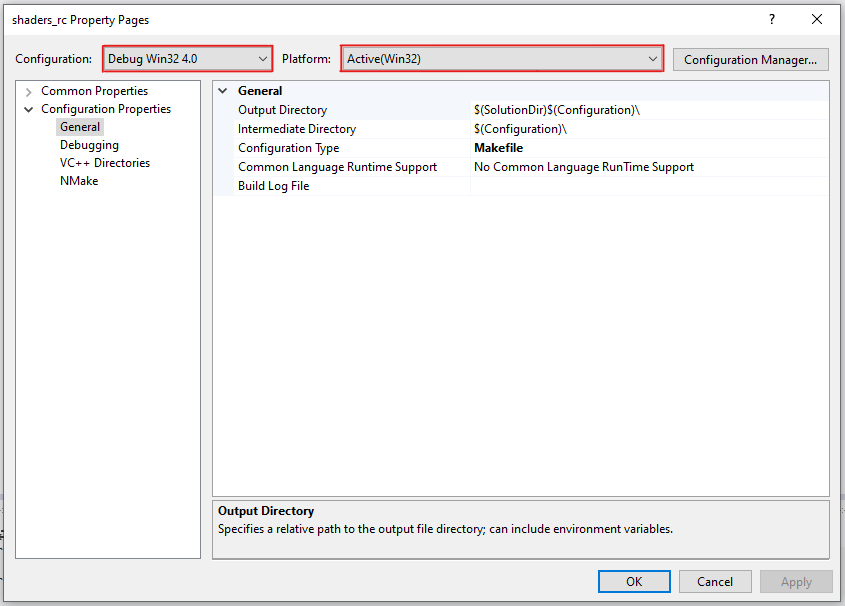

# How to build Gen 9 Shaders.

#### ***This is Experimental and not completely working***

### Requirements:
 - A prebuilt version of normal shaders, you can compile them or download them
 - Make sure you setup the source code (follow all steps on PC Guide up to [Patching Source Code and Tools](https://github.com/FranklinClintonDev/gta-v-source-code-guide/blob/main/PC.md#patching-source-code-and-tools))

### Compile Shaders

1. Run `X:\gta5\src\dev_ng\game\VS_Project\load_sln_unity_2012.bat`.

- A warning will show in the Command Prompt Window stating you are missing an SDK, please ignore it and press any key to continue and open it with Visual Studio 2012.

- If you are promoted with `Choose Default Environment Settings` Select `General Development Settings` and at `Local Help Documentation` select `None`.

2. Once the solution loads, open the drop down menu that says `Debug` at the top, select `Configuration Manager`.

3. Change `Active Solution Platform` to `x64` then close the configuration window.

4. On the `solution explorer` scroll down to `shaders_rc` and right click then click on properties.

5. Set the `Platform` to `Win32` and the `Configuration` to `(Debug Win32 4.0)`.

# PROGRESS MARK (After this the info is not tested by me)

5) Rename this
`$(MSBuildProjectDirectory)\batch\rsm_build_win32_40.bat dev`
`$(MSBuildProjectDirectory)\batch\rsm_rebuild_win32_40.bat dev`
`$(MSBuildProjectDirectory)\batch\rsm_clean_win32_40.bat dev`

To this 
`$(MSBuildProjectDirectory)\batch\rsm_build_win32_50.bat dev`
`$(MSBuildProjectDirectory)\batch\rsm_rebuild_win32_50.bat dev`
`$(MSBuildProjectDirectory)\batch\rsm_clean_win32_50.bat dev`

To see the progress and watch its status, in the taskbar, open the Overflow Menu (the small ^ in the taskbar on the right).
Find `IncrediBuild Agent` (the one with a green arrow), right-click it, and press `Build Monitor`.
In `Build Monitor`, on the left press the icon at the top that should say `Progress`.
You should now see what you're building, and at the bottom left of the window, you'll see a percentage of how complete it is out of 100%.

6. After that build the shaders with incredibuild.
7. Wait for the build to finish (Expect for errors and the build to fail)
8. After the build finshes 90% of the build should have stil completed
9. Your compiled sharders should be `X:\gta5\titleupdate\dev_ng\common\shaders`
10. Drag the contents from `win32_50` to `win32_40` in your shaders folder
11. Launch the build and enjoy!
